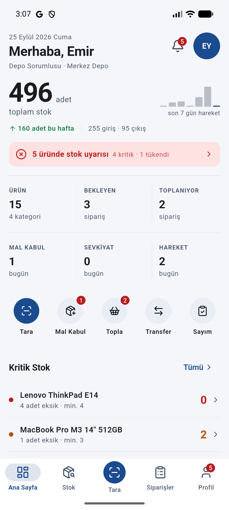
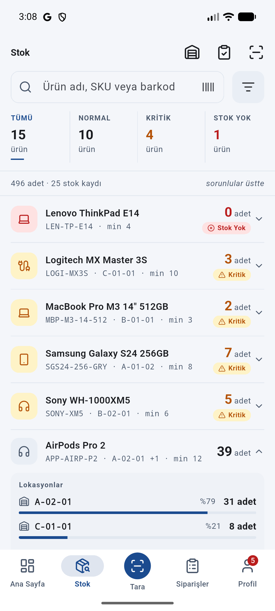
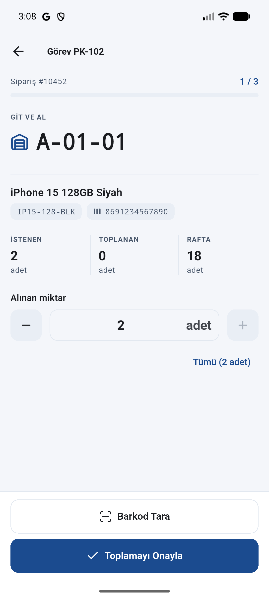
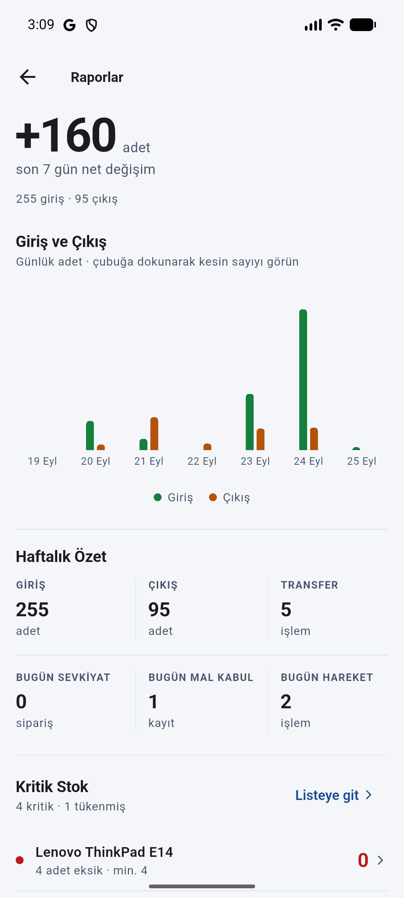

<p align="center">
  
</p>

# Depom Düzende — Mobil WMS Demosu

Bir isimden çok bir iddia. İşaret de onu çiziyor: bir rafa **hizalanmış**
üç koli.

Depo çalışanının elindeki mobil depo yönetim sistemi. Ürün arama, barkod
okuma, mal kabul, raf yerleştirme, sipariş toplama, stok transferi, sayım ve
sevkiyat — hepsi uçtan uca çalışıyor.

**Backend yok.** Uygulama tamamen cihaz belleğindeki mock veriyle çalışır.
Ama işlemler sahte değil: bir transfer yaptığınızda iki rafın stoğu gerçekten
değişir, hareket kaydı oluşur ve dashboard'daki sayılar güncellenir.

<p align="center">
  
  
  
  
</p>

---

## Kurulum

```bash
flutter pub get
flutter run
```

Flutter 3.47+ ve Dart 3.13+ gerekir (`pubspec.yaml`: `sdk: ^3.13.4`). Android, iOS ve masaüstünde çalışır.

Barkod tarama gerçek kamerayı kullanır; kamera yoksa veya izin verilmezse
ekran kendiliğinden **demo barkod listesine** düşer, yani uygulama her
koşulda çalışır.

```bash
flutter analyze   # statik kontrol
flutter test      # 455 test
```

---

## Demo senaryoları

Altı senaryonun tamamı uygulamada uçtan uca çalışır. Her biri emülatörde
gerçek dokunuşlarla doğrulandı.

### 1 — Barkod ile ürün bulma

**Tara** sekmesi → `8691234567890` → tarama sonucu → **Ürün Detayı**

iPhone 15'in 24 adet stoğu ve iki raftaki dağılımı (`A-01-01 → 18`,
`B-03-02 → 6`) pay çubuklarıyla görünür.

### 2 — Mal kabul ve yerleştirme

**Mal Kabul** → `GR-1024` → iPhone satırı → miktar `50` → `A-01-01` → **Yerleştir**

> Toplam stok **496 → 546** olur, kayıt "Tamamlandı"ya geçer, bir mal kabul
> hareketi oluşur. Dashboard'a dönünce yeni sayı orada.

### 3 — Sipariş toplama

**Siparişler** → `#10452` → **Toplamaya Devam Et** → üç ürünü sırayla onayla

> `A-01-01` → `B-01-02` → `C-01-01`. Her onayda stok azalır ve hareket
> oluşur. Son üründen sonra "Sipariş toplama tamamlandı ✓" ekranı gelir,
> sipariş "Toplandı"ya geçer.

### 4 — Stok transferi

**Transfer** → iPhone 15 → kaynak `A-01-01` → hedef `B-03-02` → miktar `5`

> Onaydan **önce** sonucu gösterir: `A-01-01: 18 → 13`, `B-03-02: 6 → 11`,
> "Toplam stok değişmez: 24 adet". Transfer mal çıkarmaz, yerini değiştirir.

### 5 — Stok sayımı

**Sayım** → `IC-2026-031` → iPhone → fiziksel `17` (sistem 18) → **Sayımı Tamamla**

> Fark `−1` kırmızı görünür ve ne olacağı yazılır: "stok 18 yerine 17 adet
> olarak güncellenecek". Onayda stok düzeltilir ve bir sayım düzeltmesi
> hareketi oluşur.

### 6 — Sevkiyat

**Siparişler** → kamyon ikonu → `SH-2026-013` → **Sevk Et**

> Durum "Sevk Edildi" olur, takip numarası üretilir, sipariş de sevk
> edilmiş sayılır. Sevk **stok hareketi üretmez** — mal zaten toplama
> sırasında raftan düşmüştür.

---

## Mimari

```
UI (features/)
 ↓ ref.watch
Riverpod sağlayıcıları
 ↓ arayüz üzerinden
Repository (abstract)     ←  gelecekte ApiXRepository buraya takılır
 ↓ mock implementasyonu
WarehouseDatabase          ←  tek, değişebilir, bellek içi kaynak
```

**Arayüz katmanı mock mu API mi kullandığını bilmez.** Ekranlar yalnızca
repository arayüzünü tanır; bugün `MockProductRepository`, yarın
`ApiProductRepository` bağlanabilir ve tek bir ekran değişmez.

### İşlemler neden gerçekten çalışıyor

Bütün yazma işlemleri tek bir kapıdan geçer (`WarehouseActions`) ve her
işlemden sonra bir **revizyon sayacı** artar:

```dart
class DataRevision extends Notifier<int> {
  void bump() => state = state + 1;
}
```

Tüm okuma sağlayıcıları bu sayacı izler. Bir transfer yapıldığında
dashboard, stok listesi, ürün detayı, lokasyon doluluğu ve hareket geçmişi
**kendiliğinden** yenilenir. Elle `invalidate` zinciri yoktur; yeni bir ekran
yazan kişinin bir şey hatırlaması gerekmez.

### Klasör yapısı

```
lib/
├── app/           tema, rotalar, sağlayıcılar
├── core/          yeniden kullanılabilir bileşenler, biçimlendiriciler
├── models/        18 model sınıfı + 13 durum enum'ı
├── data/
│   ├── mock/      birbirine bağlı mock veri seti
│   ├── repositories/  5 arayüz + mock implementasyonları
│   └── warehouse_database.dart   iş kuralları burada
└── features/      16 modül (her biri presentation/ + providers/)
```

İş kuralları **tek bir dosyada**: `warehouse_database.dart`. Negatif stok
oluşamaz, aynı rafa transfer yapılamaz, toplanmayan sipariş sevk edilemez,
sevk edilen sipariş yeniden sevk edilemez. Kural ihlalinde `WarehouseException`
fırlar ve ekran bunu kullanıcıya anlaşılır bir mesajla gösterir.

---

## Tasarım kararları

Ekranlar şartnameyi birebir uygularken birkaç yerde bilinçli olarak ayrıldı.
En önemlileri:

**Kutular yerine ayraçlar.** Otuz ürünü kartlara koymak yüz yirmi kenar
çizgisi demek. Listeler ayraçla ayrılmış satırlardan oluşuyor; göz ürün
adlarını daha hızlı tarıyor.

**Renk yalnızca gerçek durum için.** Her satıra "Normal" rozeti basmak
listeyi yeşile boğar ve asıl dikkat edilmesi gerekenleri görünmez kılar.
Normal stokta rozet yok; kritik ve tükenmiş ürünlerde hem miktar renkleniyor
hem rozet çıkıyor.

**Her sayının bağlamı var.** "496 adet" tek başına bir şey söylemez;
"496 adet · 25 stok kaydı · sorunlular üstte" söyler.

**Toplama ekranında en büyük öğe rafın kodu.** Ürün adı değil — depo
çalışanı koridorda yürürken *nereye gideceğini* arıyor. `A-01-01` ile
`A-01-11` normal yazıda birbirine benzer, bu yüzden kodlar monospace.

**İşlem öncesi sonuç gösterilir.** Transfer geri alınamaz; kullanıcı
"5 adet yeterli mi" sorusunu onaylamadan önce cevaplayabilmeli.

Şartnameden tek gerçek sapma: **sayım lokasyon bazlıdır.** Şartnamenin
örneği "Sistem: 24" diyor ama 24, iPhone'un tüm depodaki toplamı; `A-01-01`
rafında 18 var. Sayan kişi tek bir rafın önünde durduğu için sistem miktarı
o rafınki olmalıdır.

---

## Mock veri

Veri rastgele değil, **birbirine bağlı**:

```
Ürün → Stok → Lokasyon → Sipariş → Toplama → Sevkiyat → Hareket
```

15 ürün, 4 kategori, 2 depo, 6 bölge, 15 lokasyon, 26 stok kaydı
(toplam **496 adet**), 10 sipariş (altı durumun hepsinden), 6 toplama görevi,
6 mal kabul, 4 sevkiyat, 4 sayım, 27 hareket, 7 bildirim.

Kritik ve tükenmiş ürünler gerçekten kritik: ThinkPad E14 stokta yok,
MX Master 3S minimum 10'a karşılık 3 adet. Tamamlanmış sayımların girilen
miktarları mevcut stokla birebir örtüşüyor, çünkü sayım onaylandığında stok o
değere çekilmiş.

Veri kalıcı değildir — uygulama yeniden başladığında başlangıç durumuna
döner. Demo için istenen davranış budur.

---

## Testler

```
455 test · 18 dosya
```

Testlerin ağırlığı arayüzde değil **sonuçta**: bir kabul yapıldığında stok
arttı mı, tam olarak bir hareket mi oluştu, sipariş durumu değişti mi.

Ayrıca `test/ui_states_test.dart` adreslenebilir 21 ekranın tamamını üç kez
çiziyor — hata simülasyonu açıkken, 320 piksel genişlikte ve en büyük yazı
tipiyle. Modül testleri ekranın ne yaptığını doğrular; bu dosya ekranın
çökmediğini doğrular.

---

## Bağımlılıklar

| Paket | Neden |
|---|---|
| `flutter_riverpod` | Durum yönetimi; `Notifier` / `AsyncNotifier` API'si |
| `go_router` | `StatefulShellRoute` ile sekme başına geçmiş |
| `mobile_scanner` | Barkod / QR kamera |
| `fl_chart` | Raporlama grafikleri |
| `intl` | tr_TR tarih ve sayı biçimlendirme |
| `shared_preferences` | Tema tercihinin saklanması |
| `equatable` | 18 modelde elle `==` / `hashCode` yazmamak için |
| `skeletonizer` | İskelet yükleme durumları |
| `lucide_icons_flutter` | Tek ikon ailesi (forklift ve palet dahil) |

Kod üretimi (`build_runner`) kullanılmadı — bu ölçekte gereksiz karmaşa.

---

## Kapsam dışı

Gerçek backend, REST çağrısı, Firebase, gerçek kimlik doğrulama, production
veritabanı. Uygulama tamamen çevrimdışı çalışır ve kullanıcı sabittir
(Emir Yavuz · Depo Sorumlusu · Merkez Depo).
